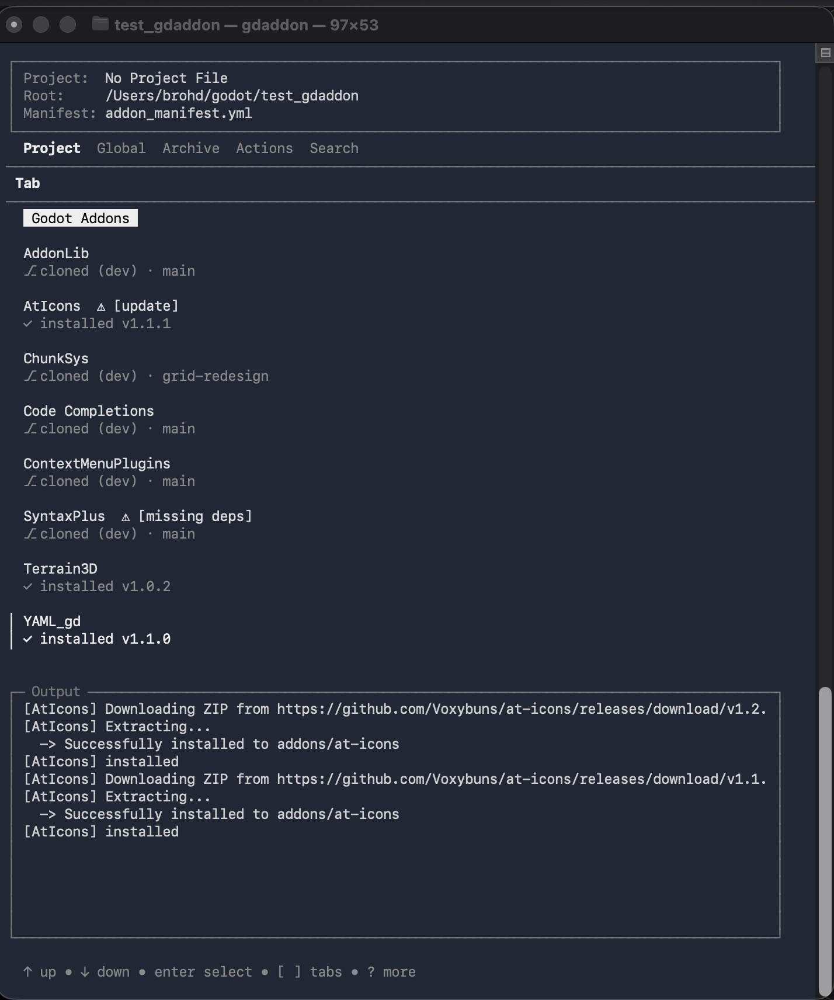

## gdaddon - TUI addon manager for Godot



### Features
 - Project manifest - one button to install all logged plugins to pinned version
 - Update Check - checks for new releases of all your plugins
 - Declare dependencies - reads from plugin.cfg, see below
 - Search - query Github, Asset Store, Asset Lib to add directly to your project
 - Global manifest - quickly add your favorite addons to your project
 - Addon sets - save a collection of addons that can be added together
 - Archive - save a copy of any package locally, can be used for install

### Examples
Installing 25 addons: [here](https://youtu.be/1EIBzfUs50g)

## Quick Start

### Install

#### [gdaddon - EditorPlugin](https://github.com/brohd11/gdaddon-EditorPlugin)
This is the Godot EditorPlugin companion to gdaddon. You can actually download and install the binary from here if you want. It should remove the need for quarantine management on macOS.

Open the gdaddon dialog and it will prompt you to update/install the binary.

#### To install from this repo:

There are binaries under releases, you can also build with Go and Make: `make` will build for all current platforms.

On macOS, downloaded binaries may have quarantine status that needs to be cleared before you can execute: `xattr -dr com.apple.quarantine path/to/gdaddon`

Alternatively, build with Go and this is not a problem.

With your fresh binary, run `gdaddon install` from the download or build directory. This will launch an installer with a few options:
 - system - Can be directly accessed by name `gdaddon`, needs permissions
 - local - Can be directly accessed by name, if directory is in PATH, no permissions
 - ~/.gdaddon - Can not be directly accessed by name, but can be launched directly from the companion EditorPlugin, no permissions

After install you can delete the download folder.

**Note:** On Windows, `install.bat` will launch a terminal and start `gdaddon install` when double clicked. The linux and mac install helpers will be removed since you need to open a terminal to either: (on linux) run the install helper, (on mac) dequarantine the install helper and binary. They are redundant artifacts from before the logic moved from shell -> `gdaddon install`

---

### Manifest
Each addon has an entry in the manifest. This editable via the TUI, or by hand.
The path field is for installing repos that are in the submodule format, where it is difficult to infer the plugin directory name.

```
MyAddon:
    tag: "v1.0.0-stable"
	version: "1.0.0"
	url: https://github.com/user/repo/archive/refs/tags/v1.0.0-stable.zip
	path: addons/terrain_3d
```

### Dependency Management
If your addon relies on third party content, you can define those in the plugin.cfg
```
[plugin]
name="My Plugin"
---
deps=["user/repo/@v1.0.0"] # point to the release tag
```
When the addon is installed, the plugin.cfg will be read and checked for dependencies. If they are found and the dependency is not present, the addon will be flagged and you can run the get dependencies command to add them to your project.

If you don't have a tagged version, just the repo will be added to your project where you can add the proper version manually.

There is also an "Install All + Deps" command that will  install, check for dependencies, loop, until there are none left that can be installed.


More docs can be found [here](doc/docs.md)