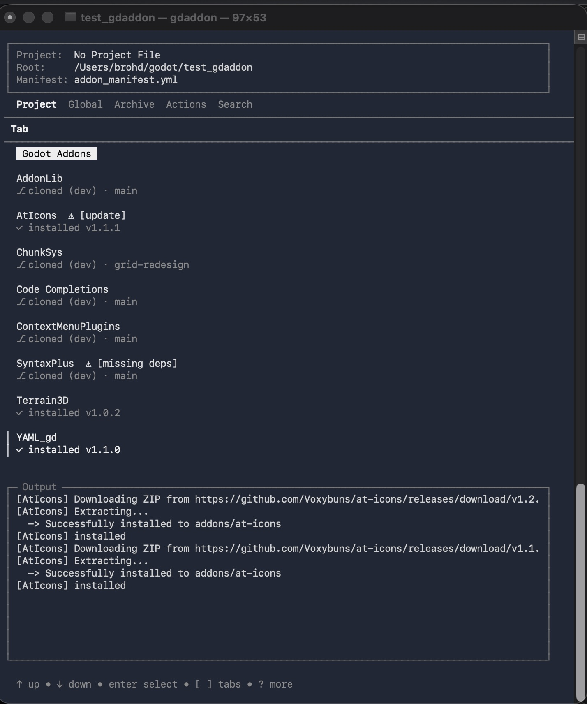

## gdaddon - TUI addon manager for Godot



### Features
 - Project manifest - one button to install all logged plugins to pinned version
 - Update Check - checks for new releases of all your plugins
 - Declare dependencies - reads from plugin.cfg, see below
 - Search - query Github, Asset Store, Asset Lib to add directly to your project
 - Global manifest - quickly add your favorite addons to your project
 - Addon sets - save a collection of addons that can be added together
 - Archive - save a copy of any package locally, can be used for install
 - One-shot CLI install - `gdaddon install owner/repo`, dependencies and all

### Examples
Installing 25 addons: [here](https://youtu.be/1EIBzfUs50g)

#### [gdaddon - EditorPlugin](https://github.com/brohd11/gdaddon-EditorPlugin)
This is the Godot EditorPlugin companion to gdaddon. Currently, it runs a check for updates on installed addons
and alerts if any are available.

## Quick Start

### Install

#### Quick install

Unix:
```bash
curl -fsSL https://raw.githubusercontent.com/brohd11/gdaddon/main/install.sh | sh
```

Windows:
```powershell
irm https://raw.githubusercontent.com/brohd11/gdaddon/main/install.ps1 | iex
```

To update:
```
gdaddon update
```

More install details (location, flags, etc): [shared install reference](https://github.com/brohd11/goutil/blob/main/docs/install.md).

<sub>macOS note: a binary downloaded **in a browser** gets quarantined by Gatekeeper — clear it
with `xattr -dr com.apple.quarantine path/to/binary`. This doesn't apply to the installer
above; the attribute is set by browsers, not by `curl`.</sub>


### Manifest
Each addon has an entry in the manifest. This editable via the TUI, or by hand.
The path field is for installing repos that are in the submodule format, where it is difficult to infer the plugin directory name.

A branch can be installed as a live git clone (`kind: clone`) or as a commit-pinned package snapshot — the latter records the branch's HEAD `commit:` sha and installs that commit's archive, so it's reproducible. See the [docs](doc/docs.md) for details.

```
MyAddon:
    tag: "v1.0.0-stable"
	version: "1.0.0"
	url: https://github.com/user/repo/archive/refs/tags/v1.0.0-stable.zip
	path: addons/terrain_3d
```

### Dependency Management
If your addon relies on third party content, you can define those in the plugin.cfg
```
[plugin]
name="My Plugin"
---
deps=["user/repo/@v1.0.0"] # point to the release tag
```
When the addon is installed, the plugin.cfg will be read and checked for dependencies. If they are found and the dependency is not present, the addon will be flagged and you can run the get dependencies command to add them to your project.

If you don't have a tagged version, just the repo will be added to your project where you can add the proper version manually.

There is also an "Install All + Deps" command that will  install, check for dependencies, loop, until there are none left that can be installed.

### Installing one addon from the command line

`gdaddon install` adds a single addon to the current project without opening the TUI,
along with the dependencies that addon declares (and theirs, and so on). Unlike
"Install All + Deps", nothing else in the manifest is touched.

```bash
gdaddon install user/repo-name                     # latest release
gdaddon install user/repo-name                     # a specific release
gdaddon install codeberg.org/someone/their-addon   # a host other than github.com
gdaddon install user/repo-name  --clone            # live git checkout, default branch
gdaddon install user/repo-name dev --clone
```

The project root is the git toplevel (or `--root`), and a manifest is created if there
isn't one — so this works in a fresh project. Other flags: `--asset` to pick a release
asset when a release ships several, `--name` to record it under a different name, and
`--no-deps` to skip dependency resolution.

### The full command line

```bash
gdaddon                       # the TUI (project root: the git toplevel, or name one)
gdaddon install --all         # install everything the manifest lists, plus declared deps
gdaddon install owner/repo    # install one addon, plus its declared deps
gdaddon list                  # the manifest's install status
gdaddon list --json           # the same, as JSON for tools to parse
gdaddon list --updates        # also check each addon for a newer release (network)
gdaddon update-addons         # update installed addons to their latest release
gdaddon update                # update the gdaddon binary itself
gdaddon repos -- git status   # run a command in every git repo under the project
```

`update` is the gdaddon binary; `update-addons` is the Godot addons. Everything else is
project-scoped and takes the project root as an optional argument (`install` takes it as
`--root`, since its argument is the repo).


More docs can be found [here](doc/docs.md)
